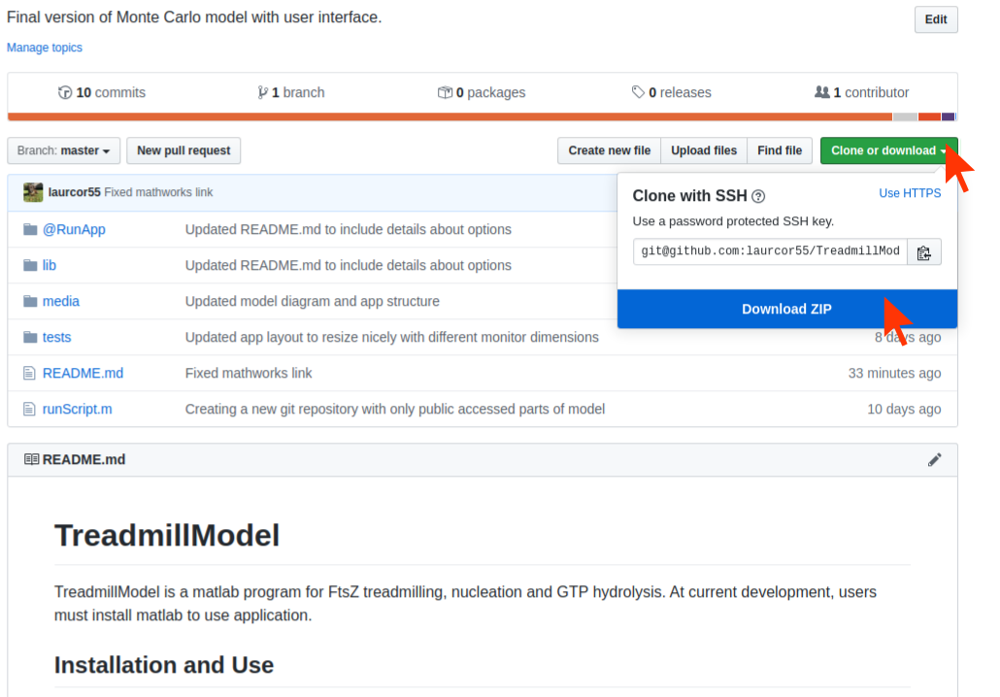
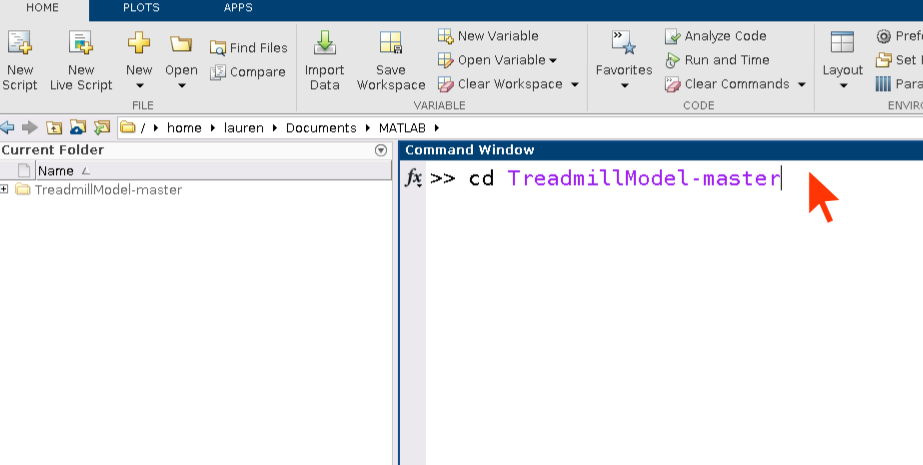
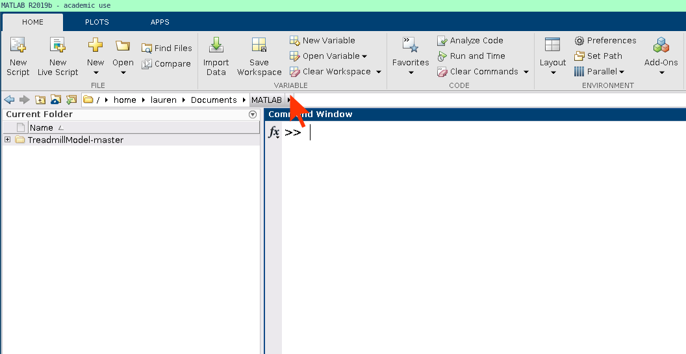
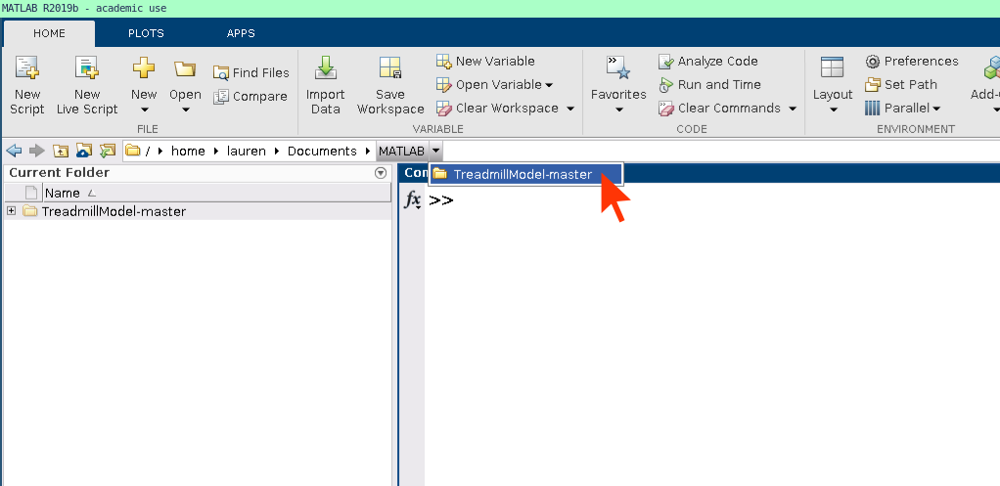
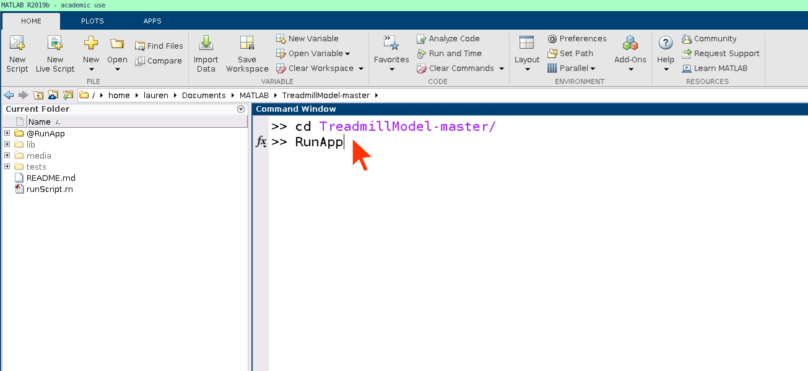
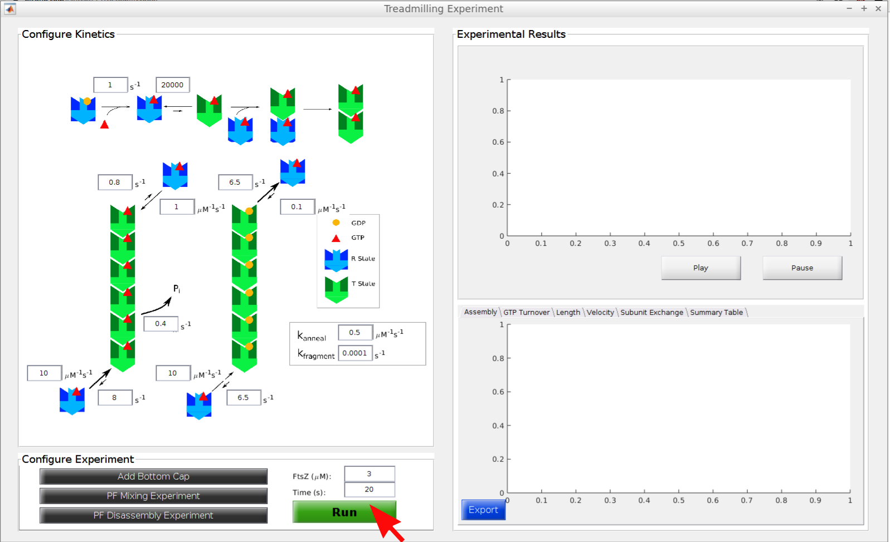
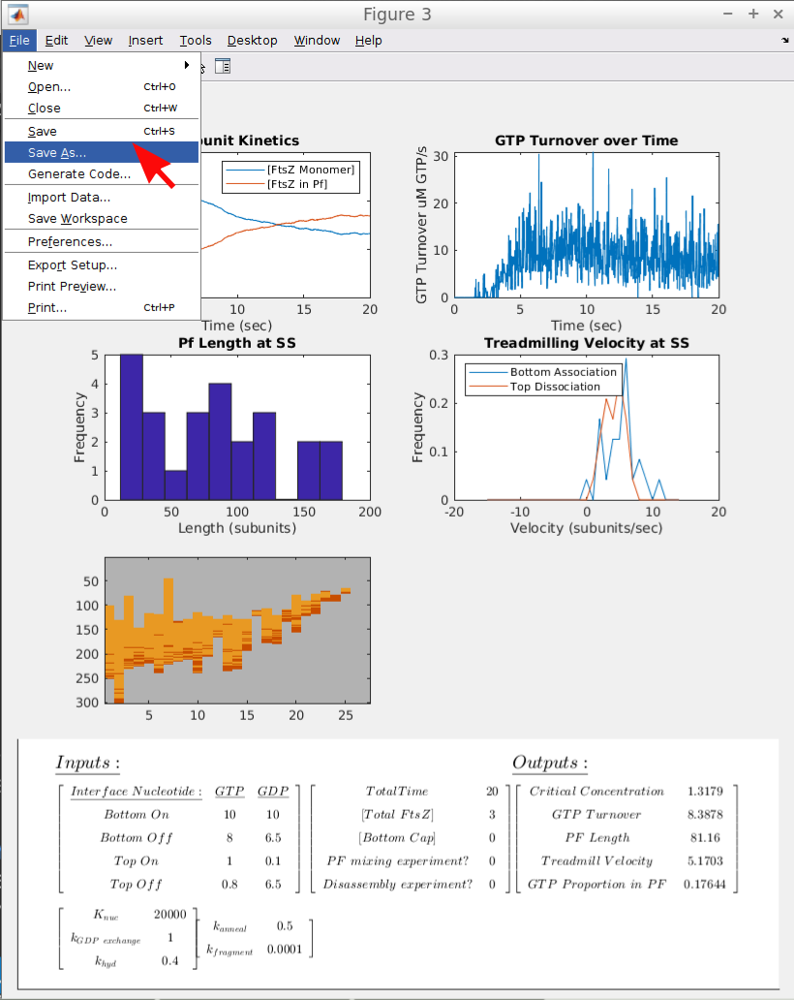

# TreadmillModel
TreadmillModel is a matlab program for FtsZ treadmilling, nucleation and GTP hydrolysis. At current development, users must install matlab to use application. 

## System Requirements
Access to matlab. Version 2017a - 2019b suggested but backwards compatibility supported. Application was developed to avoid dependencies on toolboxes. 

## Installation and Running App
1. Install matlab from [MathWorks](https://www.mathworks.com/). 
2. In web browser, visit [GitHub repository](https://github.com/laurcor55/TreadmillModel). Click **Clone or Download** and **Download Zip**. Unzip folder and move the folder `/TreadmillModel-master` to `Documents/MATLAB` folder

3. Open matlab and navigate to the `TreadmillModel-master` directory by typing the following into the command window. 
``` matlab
>> cd TreadmillModel-master
```

Alternatively, users can navigate to the folder by first clicking the small arrow beside the MATLAB directory in the top navigation bar. 

Then, users select **TreadmillModel-master** folder. 



4. Run app by typing `RunApp` and enter command window. 



## Navigating App Input

The left panel of the screen gives the input parameters, and the right panel shows results. The model comes with a set of kinetic parameters, FtsZ concentration (3 µM) and time (20 s), which can be used for an initial run by clicking the green **Run** button at the bottom. User can change any parameter by changing the number in the input boxes. To run model, click the green **Run** button at the bottom. 




The output panel will show the final array of PFs in the top window. Each vertical line is a PF, with length shown on the y axis. GTP is red and GDP is orange. User can reply this as a movie by clicking **Play**, and can **Pause** at any point. 

The bottom output panel can be toggled between Assembly, GTP turnover, etc., by clicking on the bar. To obtain a summary of input and output, click the **Export** button. This will save the file `output.html` in the `lib/export/` folder, path indicated on the screen. This can be opened in a browser. To save this file, copy and paste the file name into your web browser. Save or print it here. The next **Export** will write over the `lib/export/output.html` file. 




The app can be configured to simulate bottom cappers, PF mixing, and PF disassembly. 

### Add Bottom Cap
To add a bottom capper, click the gray **Add Bottom Cap** button at the bottom left. In the popup, adjust the kinetic parameters and the concentration of capper with numeric inputs. Press **Apply** and the green **Run** button. 

To undo adding a bottom capper, click **Add Bottom Cap**, and input 0 for the **Bottom Cap (µM)** numeric box. Click **Apply**. Accept the warning message. Continue with app. 

### PF Mixing Experiment
To simulate PF mixing, click the gray **PF Mixing Experiment** button. In the small popup, add a numeric time value in seconds. Click **OK**, then **Run**. 

To undo adding a PF mixing experiment, click the **PF Mixing Experiment** button, and click **Cancel** in the popup. 

### PF Disassembly Experiment
To simulate PF mixing, click the gray **PF Disassembly Experiment** button. In the small popup, add a numeric time value in seconds. Click **OK**, then **Run**. 

To undo adding a PF disassembly experiment, click the **PF Disassembly Experiment** button, and click **Cancel** in the popup. 
